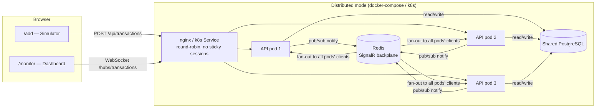

# Real-Time Financial Monitor

MVP for a real-time financial transaction monitor: a .NET backend ingests transactions over
HTTP and broadcasts them over SignalR to a React dashboard used by support agents.

## 1. Scenario recap

Transactions arrive via an ingestion API, get validated and stored, and must appear on a live
dashboard instantly. The dashboard must stay responsive even if 100 transactions arrive in a
burst, and must keep working correctly if the backend is scaled out to multiple pod replicas.

## 2. Architecture



- **Ingestion**: `POST /api/transactions` validates and stores the transaction, then broadcasts
  it over SignalR.
- **Real-time layer**: SignalR hub (`/hubs/transactions`), push-only.
- **Storage**: two modes behind the same `ITransactionRepository` interface -
  - *Single instance / local dev*: `InMemoryTransactionRepository` (`ConcurrentDictionary`),
    capped at the 5,000 most recent transactions - it represents "latest transactions", not a
    historical record, so once full it evicts the oldest entry per new insert (a `ConcurrentQueue`
    tracks insertion order for O(1) eviction) rather than growing without bound.
  - *Distributed (compose/k8s)*: `PostgresTransactionRepository`, a shared PostgreSQL database
    every pod connects to as a normal network client, so `GET /api/transactions` is consistent
    no matter which pod answers it. (An earlier design shared a SQLite file over a mounted
    volume/PVC instead - replaced for correctness reasons covered in the
    [ADR](#10-adr-distributed-real-time-synchronization-across-pod-replicas) below.)
- **Cross-pod real-time sync**: SignalR's Redis backplane (`AddStackExchangeRedis`) so a
  broadcast from any pod reaches every connected client, regardless of which pod it's attached
  to. See the ADR below.

## 3. Tech stack

| Layer | Choice |
|---|---|
| Backend | .NET 8, minimal APIs, SignalR |
| Domain/tests | xUnit, FluentAssertions, Moq, Testcontainers |
| Storage | `ConcurrentDictionary` (single instance) / PostgreSQL via Npgsql (distributed) |
| Real-time backplane | Redis (`Microsoft.AspNetCore.SignalR.StackExchangeRedis`) |
| Frontend | React 19, TypeScript, Vite, React Router, `@microsoft/signalr`, framer-motion |
| Containers | Docker (multi-stage, alpine), docker-compose, nginx |
| Orchestration | Kubernetes manifests (Deployment/Service for API, Redis, Postgres, frontend) + HorizontalPodAutoscaler |

## 4. Project structure

```
mid-fullstack-assessment/
├── backend/
│   ├── src/FinMonitor.Api/       # single project: Program.cs, endpoints, hub, Dockerfile,
│   │   ├── Models/, DTOs/        # plus model/validation/repository/service layers below,
│   │   ├── Validation/           # organized by folder/namespace rather than a separate
│   │   ├── Repositories/         # project - FinMonitor.Domain.* namespaces are kept for
│   │   ├── Services/             # clarity even though everything now lives in one project
│   │   └── Realtime/, Endpoints/, Hubs/, Middleware/
│   └── tests/FinMonitor.Tests/   # xUnit + Testcontainers (real Postgres in CI-less integration tests)
├── frontend/                     # Vite + React + TypeScript
├── docker-compose.yml            # redis + postgres + 3 API replicas + nginx LB (distributed proof)
├── docker/nginx-lb.conf          # WS-aware load balancer config, round-robin
├── k8s/                          # Deployment/Service manifests for api, redis, postgres, frontend + hpa.yaml
└── scripts/hammer.ps1            # 100-rapid-POST load test (standalone, without the UI button)
```

## 5. Run locally (single instance)

No Redis, no Docker needed - in-memory storage, one backend process.

```bash
cd backend/src/FinMonitor.Api
dotnet run --urls http://localhost:5080
```

```bash
cd frontend
npm install
npm run dev
```

Open `http://localhost:5173/add` to send transactions and `http://localhost:5173/monitor` in
another tab to watch them arrive live. Vite's dev server proxies `/api` and `/hubs` to
`localhost:5080` (see `frontend/vite.config.ts`) so no CORS setup is needed in dev.

## 6. Run the distributed proof (docker-compose)

> **Verified live.** `docker compose up --build` was run end-to-end: 6 sequential POSTs to
> `http://localhost:8080/api/transactions` succeeded, `GET /api/transactions` showed all of them
> regardless of which pod served each POST (shared Postgres, confirmed both via the API and by
> querying Postgres directly), and a browser connected to `/monitor` received every one of them
> in real time over the SignalR/Redis backplane as they arrived - confirmed via the browser
> console and DOM, not just by inspection. nginx's `/api/` upstream (`docker/nginx-lb.conf`) is
> plain round-robin across the three replicas, no sticky sessions - see item 2 below for why
> `/hubs/` needs the opposite.
>
> Real bugs surfaced and were fixed while getting this to work, in case you hit the same ones on
> a different machine:
> 1. `.dockerignore` was at `backend/.dockerignore`, but the build context (per
>    `docker-compose.yml`) is `backend/src` - Docker only honors a `.dockerignore` at the context
>    root, so it was silently ignored and stale `obj/` folders from local Windows `dotnet build`
>    runs leaked into the image, overwriting the fresh Linux restore output with one containing a
>    Windows-only NuGet fallback path and breaking `dotnet publish`. Fixed by moving it to
>    `backend/src/.dockerignore`.
> 2. **The dashboard couldn't connect to the hub at all through the LB**
>    (`WebSocket failed to connect... check that sticky sessions are enabled`). A real, separate
>    SignalR requirement, not a bug in the Redis backplane itself - SignalR's `negotiate` call
>    and the follow-up WebSocket/SSE/LongPolling upgrade must land on the *same* server, because
>    the connection id only exists in that one process's memory; the Redis backplane broadcasts
>    *messages* between already-connected clients across pods, it doesn't (and can't) share a
>    live in-process transport handle. Fixed with **two separate upstream pools** in
>    `docker/nginx-lb.conf`: `/hubs/` uses `ip_hash` (sticky, required for the handshake), `/api/`
>    stays plain round-robin (not sticky - this is the exact path the bonus is about, and it has
>    to stay non-sticky for the proof to mean anything).
> 3. **API containers starting faster than Postgres was ready to accept connections** crashed the
>    whole app on startup (`Npgsql.NpgsqlException: Connection refused`) - `depends_on` in
>    compose only waits for the *container* to start, not the database *inside* it to be ready.
>    Fixed two ways: a `pg_isready` healthcheck + `depends_on: condition: service_healthy` in
>    `docker-compose.yml`, and (since Kubernetes gives no ordering guarantee between pods at all,
>    so compose-level sequencing wouldn't help there anyway) a retry-with-backoff loop around the
>    initial connection in `PostgresTransactionRepository.CreateAsync`.
> 4. **`CREATE TABLE IF NOT EXISTS` raced when many pods started at once against a fresh
>    database** (`duplicate key value violates unique constraint "pg_type_typname_nsp_index"`) -
>    a documented Postgres quirk: concurrent sessions can each see "doesn't exist yet" and
>    collide creating it. Fixed with a Postgres advisory lock (`pg_advisory_lock`) around schema
>    creation, serializing it across connections without external coordination.

```bash
docker compose up --build
```

This starts Redis, Postgres, three API replicas (`api1`/`api2`/`api3`, each with
`Redis:Enabled=true` and pointed at the shared Postgres database), and one nginx container that
serves the built frontend and round-robins `/api` and `/hubs` across the three replicas.

Open `http://localhost:8080/monitor`, then from a shell:

```bash
for i in $(seq 1 10); do
  curl -s -X POST http://localhost:8080/api/transactions \
    -H "Content-Type: application/json" \
    -d "{\"amount\": $i, \"currency\": \"USD\", \"status\": \"Completed\"}"
done
```

nginx round-robins these across `api1`/`api2`/`api3` with no sticky sessions on `/api/`. Watch
the dashboard - it picks up all 10 in real time regardless of which pod happened to handle each
POST, which is the actual proof the Redis backplane fan-out works: without it, only broadcasts
from whichever pod your browser's WebSocket is connected to would show up.

**Before/after, to see the bug the backplane fixes:** set `Redis__Enabled: "false"` for the
`api1`/`api2`/`api3` services in `docker-compose.yml`, `docker compose up --build` again, and
repeat the curl loop - the dashboard will now visibly miss transactions served by any pod other
than the one its WebSocket happens to be connected to. Re-enable it afterwards (it's `"true"` in
the committed file).

## 7. Run on Kubernetes

> **Verified live** against Docker Desktop's built-in single-node cluster (`kind` under the
> hood): all 11 manifests applied cleanly, 5 `finmonitor-api` pods came up from one `Deployment`
> (no manual per-pod duplication needed the way docker-compose's `api1`/`api2`/`api3` blocks
> are - a single k8s Service round-robins across however many pods the Deployment has),
> `GET /api/transactions` and a direct `psql` query against the Postgres pod agreed on the exact
> same count, and the dashboard received every transaction live regardless of which pod served
> the POST - the same distributed guarantees as docker-compose, this time behind a real
> Kubernetes Service.

```bash
docker build -t finmonitor-api:latest -f backend/src/FinMonitor.Api/Dockerfile backend/src
docker build -t finmonitor-frontend:latest -f frontend/Dockerfile frontend
kubectl apply -f k8s/
kubectl get pods    # wait for all to reach 1/1 Running
kubectl port-forward svc/finmonitor-frontend 8081:80
```

Open `http://localhost:8081/monitor`. (`kubectl port-forward` sidesteps any local port-80
conflict, e.g. IIS or another service already bound to it on Windows - it's simpler and more
reliable for local testing than relying on the `LoadBalancer` service's own port forwarding.)

**The same SignalR stickiness issue as docker-compose, solved the k8s way:** a single
`finmonitor-api` Service load-balances every request to a random pod per connection - fine for
`/api/`, but the hub's `negotiate` call and its WebSocket/SSE upgrade need to land on the *same*
pod. Kubernetes Services can't have different session affinity per URL path the way nginx's two
upstream pools do, so instead there's a **second Service over the same pods**,
`finmonitor-api-hub` (`k8s/service-hub.yaml`), with `sessionAffinity: ClientIP`. The frontend's
`nginx.conf` routes `/hubs/` there and `/api/` to the plain `finmonitor-api` Service - same
principle as `docker/nginx-lb.conf`, just expressed as two Services instead of two upstream
blocks.

**A k8s-specific bug worth flagging**: after replacing SQLite with Postgres, pods kept starting
successfully and POSTs kept returning `201 Created` - but a direct `psql` query against the
Postgres pod showed zero rows, and `GET /api/transactions` returned a different, small count
each time depending on which pod answered. The rebuilt image was tagged `finmonitor-api:latest`
- the same tag already cached on the cluster node from the previous (pre-Postgres) build - and
`imagePullPolicy: IfNotPresent` meant the node never checked whether the underlying image content
had changed, so pods kept running the *old* code, silently falling back to a per-pod in-memory
store (each pod's own private data explains the fluctuating counts) with zero Postgres
connections. Confirmed by rebuilding under a throwaway unique tag, which immediately fixed it.
Fixed properly by switching both `k8s/deployment.yaml` and `k8s/frontend-deployment.yaml` to
`imagePullPolicy: Always` - the right call for a local cluster with no registry in front of it
that gets rebuilt under the same tag while iterating; a real deployment pipeline would instead
tag images immutably per build/commit and could keep `IfNotPresent`.

**Storage note:** Postgres itself needs storage for its own data directory
(`k8s/postgres-pvc.yaml`), and that's `ReadWriteOnce` - correctly so, since only the single
Postgres pod ever mounts it. The API pods don't touch a volume at all anymore; they talk to
Postgres over the network like any other database client, which is exactly the point of the fix
in the ADR below.

**HPA note:** `kubectl get hpa` shows `memory: <unknown>/70%` - Docker Desktop's built-in cluster
doesn't ship a metrics-server, so there's nothing reporting pod memory usage for the
autoscaler to act on. Installing one (`kubectl apply -f https://.../metrics-server`) would let
`k8s/hpa.yaml` actually scale; not done here since it's a cluster-wide addition beyond this
assessment's scope.

## 8. Run tests

```bash
cd backend
dotnet test tests/FinMonitor.Tests/FinMonitor.Tests.csproj
```

43 tests covering validation, repository concurrency and pagination/sequence behavior (in-memory,
and Postgres via Testcontainers - a real, disposable Postgres container per test, not a mock),
the service layer (including the broadcast queue), and the HTTP endpoints end-to-end via
`WebApplicationFactory` (including pagination and the `/since/{sequence}` catch-up route). The
8 Postgres/Testcontainers tests need Docker to spin up a real container; a `[DockerRequiredFact]`
attribute (`tests/.../DockerRequiredFactAttribute.cs`) checks `docker info` once at test discovery
and marks them `Skipped` - not failed - if Docker isn't reachable, so the full suite is still
"executable automatically" (per the assignment's Unit Tests requirement) in an environment
without Docker; the other 35 tests never depend on it.

**On the TDD process**: tests were written before their corresponding implementation, one
component at a time (Validator → Repository/concurrency → Service → Endpoints), confirmed to
fail to compile ("red") before writing the minimal code to pass ("green"). Model/DTO shapes were
fixed first as a design step, not implementation. This is stated plainly here rather than
claimed after the fact - the honest description of a single-session build.

The assignment's unit-test requirement (§3) is scoped to backend processing/concurrency/storage;
there's no frontend unit-test suite. The frontend is verified by `npm run build` (type-checked)
and by manually driving both routes in a browser - see the [load-test verification](#9-load-test-verification)
section below for what that looked like in practice, including two real bugs it caught.

## 9. Load-test verification

The Simulator page (`/add`) has a **"Fire 100"** button that fires 100 concurrent POSTs from the
browser and reports how many succeeded and how long it took - a live, demo-able proof of the "UI
stays responsive with 100 rapid transactions" requirement. `scripts/hammer.ps1` does the same
thing from PowerShell, independent of the UI, for a from-outside check.

This was run for real during development, against the actual backend and dashboard (not just
assumed to work), which surfaced two real bugs before they shipped:

1. **Dropped transactions under load** (`useTransactionStream.ts`): the dedup `Set` was being
   mutated *inside* the `setTransactions` updater function. React (in StrictMode) double-invokes
   functional updaters to catch impure ones; the second invocation saw the ids as already "seen"
   and returned the previous state unchanged, silently reverting real updates. Fix: compute the
   deduped batch *before* calling `setTransactions`, so the updater itself is a pure function of
   `prev`.
2. **Filter stopped working at ~100 rows** (`TransactionGrid.tsx`): `framer-motion`'s
   `AnimatePresence` failed to remove exited rows from the DOM at this list size when animating
   `<tr>` elements, so filtering appeared to update the count but not the rendered rows. Fix:
   drop `AnimatePresence`'s exit-tracking (a bonus nicety) rather than risk it undermining a core
   requirement; rows still get an entrance fade/slide, which doesn't need exit-tracking.

Both were caught by actually running the "Fire 100" flow in a browser and checking the resulting
DOM/state, not by inspection - which is the whole point of that button.

## 10. ADR: Distributed Real-Time Synchronization Across Pod Replicas

**Context.** If this backend is deployed as N pod replicas behind a load balancer, a client's
WebSocket connects to exactly one pod. By default, SignalR keeps its connected-client list in
that pod's memory only, so `Clients.All.SendAsync(...)` on Pod A never reaches a client connected
to Pod B. Similarly, if storage were per-pod in-memory, `GET /api/transactions` would only ever
reflect whatever that one pod happened to receive.

**Decision.** Two changes, addressing the two halves of the problem:
- **Real-time fan-out**: SignalR's official Redis backplane
  (`AddSignalR().AddStackExchangeRedis(...)`). Every pod publishes broadcasts to a shared Redis
  pub/sub channel; every pod's SignalR runtime subscribes and re-broadcasts to its own locally
  connected clients. Feature-flagged via `Redis:Enabled` (default `false`) so local single-instance
  dev needs no Redis at all. The connection string uses `abortConnect=false` so a Redis outage
  degrades to pod-local broadcast instead of crashing the app.
- **Consistent storage**: in distributed mode, `Storage:Provider=Postgres` switches the
  repository to a shared PostgreSQL database every pod connects to as a normal client, so
  `GET /api/transactions` returns the same answer regardless of which pod serves the request.
  Single-instance/local dev keeps the simpler in-memory `ConcurrentDictionary` (no
  shared-storage problem exists with one process).

**Why Postgres and not a shared SQLite file (what was actually tried first).** The first version
of this fix pointed every pod at one SQLite file on a shared volume/PVC. That was wrong, and not
just as a matter of opinion - [SQLite's own documentation](https://www.sqlite.org/lockingv3.html)
states it plainly:

> Network filesystems...do not support locking correctly, or do not support it at all... it is
> not safe to use SQLite for reading and writing on a network filesystem.

A `ReadWriteMany` volume in a real multi-node cluster is almost always backed by exactly that
kind of network filesystem (NFS, EFS, Azure Files) - the one case SQLite explicitly says is
unsafe, with real risk of file corruption, not just a logical race condition. And even with
perfectly reliable locking, SQLite is single-writer by design (WAL mode doesn't change that) -
every pod would still serialize behind one writer, which defeats the actual point of having
multiple replicas and directly fights the "instantly update" requirement with exactly the
bottleneck multiple replicas exist to avoid. Postgres is built for concurrent multi-writer
access, which is what this scenario actually needs; SQLite's locking model was never meant to
solve it, and no amount of extra locking code in this repo would have changed that.

**Consequences.**
- (+) Near-real-time cross-pod fan-out using an officially supported SignalR extension; minimal
  code change (one conditional `AddStackExchangeRedis` call).
- (+) Consistent read-your-writes across pods for the GET snapshot, closing the gap a purely
  in-memory distributed store would leave - and, unlike the SQLite version, genuinely safe under
  real concurrent writers (proven in `PostgresTransactionRepositoryTests` against a real Postgres
  container via Testcontainers, not a mock).
- (−) Redis becomes an infra dependency and adds a latency hop; it's a SPOF for cross-pod
  real-time sync unless run HA (not done here - documented, not implemented).
- (−) Postgres is a second infra dependency and, as deployed here (`k8s/postgres-deployment.yaml`,
  a single replica), is itself a SPOF - a real production deployment would use a managed Postgres
  (RDS, Cloud SQL, Azure Database for PostgreSQL) or a proper HA setup, not a single pod.
- (−) Every pod now needs network access to one more service and a connection pool to manage;
  marginally more moving parts than a local file, traded deliberately for actual write safety.

**Alternatives considered.**
- *SQLite over a shared volume*: tried first, reverted - see above. Kept as the canonical example
  in this ADR of a plausible-looking fix that doesn't actually hold up, rather than deleting the
  evidence that it was considered.
- *Sticky sessions for the ingestion API* (`POST /api/transactions`, route a client to the same
  pod every time): rejected - it would hide the exact bug this ADR solves rather than fixing it.
  Note this is a *different* question from whether the SignalR *hub connection itself* needs
  stickiness - it does, for an unrelated reason (see the implementation notes in §6/§7): the
  `negotiate` handshake and the transport upgrade must land on the same process. That's handled
  at the load-balancer/Service level and doesn't touch the ingestion path, so the round-robin
  proof over `/api/` stays meaningful.
- *Client-side polling instead of push*: rejected - contradicts the "instant" real-time
  requirement outright.
- *Shared external store from the start* (skip in-memory entirely, even for single-instance
  mode): rejected for local dev - it would mean every developer needs Postgres/Docker running
  just to run the app once, for no benefit in the single-instance case where the
  distributed-storage problem doesn't exist yet.

## 11. Bonus checklist

| Item | Status |
|---|---|
| Distributed architecture - described | ✅ (ADR above) |
| Distributed architecture - implemented | ✅ Redis backplane + shared Postgres - **verified live** end-to-end via both `docker compose up --build` and a real Kubernetes deployment (round-robin load balancing across pods, shared storage confirmed via direct DB query, real-time browser delivery across pods - see §6/§7) |
| Dockerfile, production-optimized | ✅ multi-stage, alpine, non-root, `DOTNET_SYSTEM_GLOBALIZATION_INVARIANT=true` - built and run live |
| Kubernetes manifests | ✅ **verified live** on Docker Desktop's built-in cluster - all 11 manifests applied, 5 `finmonitor-api` pods + 2 frontend pods + Postgres + Redis all `1/1 Running`, PVC bound, round-robin + shared storage + real-time delivery all confirmed (see §7) |
| Horizontal autoscaling | ✅ `k8s/hpa.yaml` - 3-10 replicas, scales on 70% memory utilization. A separate concern from the sync fix: correctness across pods (Redis/Postgres) has to hold first, or autoscaling would just add more pods hammering the same database harder. Applied live but shows `<unknown>` - Docker Desktop's cluster has no metrics-server installed (see §7) |
| UI animation on new transactions | ✅ row entrance fade/slide (framer-motion) |
| UI animation on status change | ✅ CSS transition on the status badge |
| List virtualization | ❌ deliberately skipped - batching + memoization is sufficient at this scale (see §12), and it fights row-level exit animations |
| Redis/Postgres high availability | ❌ future work, documented in the ADR |

## 12. Hardening pass: async I/O, startup, and correctness

A follow-up pass addressed nine issues found during a deeper review of how this behaves under
real multi-pod load, not just the happy path. In priority order:

**Critical - required before a real multi-pod run:**

1. **The Postgres repository is now genuinely async.** `PostgresTransactionRepository` previously
   used synchronous ADO.NET calls (`connection.Open()`, `ExecuteReader()`) inside an otherwise-async
   request pipeline - each call blocked a thread-pool thread for the full network round trip to
   Postgres. `ITransactionRepository` is now `Task`-returning end to end
   (`OpenAsync`/`ExecuteReaderAsync`/`ExecuteNonQueryAsync`/`ReadAsync`, `CancellationToken` threaded
   through), which matters exactly under the "100 requests arrive quickly" load this project is
   meant to survive - that's when thread-pool starvation from blocking calls would actually bite.
2. **Startup no longer blocks on `.GetAwaiter().GetResult()`.** Connecting to Postgres and creating
   the schema now happens in `StorageStartupHostedService`, not synchronously in `Program.cs`.
   `/healthz` reflects real readiness (`StartupHealthState`, flipped once storage init succeeds)
   instead of a hardcoded `"Healthy"`, and `k8s/deployment.yaml` has a `startupProbe` with enough
   budget (~75s: `periodSeconds: 5 * failureThreshold: 15`) for the connect-retry loop (10 attempts,
   each capped at a 3s connection timeout plus a 2s backoff, ~50s worst case) to succeed before
   liveness/readiness even start evaluating - previously a slow/unavailable Postgres at startup
   could get the pod killed mid-retry. (Checked directly against an unreachable Postgres: whether
   Kestrel's port opens immediately - serving 503 while retrying - or only once storage succeeds -
   connection-refused until then - k8s's `httpGet` probe treats both identically as "failed, retry",
   and either way resolves well inside the 75s budget. So this is a deliberate implementation
   choice, not something the current probe configuration requires either way of.)
3. **Distributed mode fails fast instead of silently degrading.** A new `Deployment:Mode=Distributed`
   switch (set in `k8s/deployment.yaml` and `docker-compose.yml`) makes `Program.cs` refuse to start
   - a loud `InvalidOperationException`, visible as `CrashLoopBackOff` - unless `Storage:Provider=Postgres`
   and `Redis:Enabled=true` are both actually set. Without this, a typo'd or missing environment
   variable could silently leave a "distributed" deployment running on a per-pod in-memory store
   (each pod's data diverging from the others) or without the SignalR backplane (broadcasts from one
   pod never reaching clients on another) - both look like they started successfully and both quietly
   break the exact guarantees §10's ADR is about. The same fail-fast now also covers a misspelled
   `Storage:Provider` on its own (e.g. `Postgre` instead of `Postgres`), not just the
   Postgres-required-by-distributed-mode case - see `Options/StorageOptions.cs`.

**Very important - performance and correctness:**

6. **`GET /api/transactions` now uses real keyset (cursor) pagination**, not just a `?limit=` cap on
   an unbounded table scan. It previously returned the entire table on every call, a cost that only
   grows over the deployment's lifetime with no corresponding benefit - the frontend only ever keeps
   its most recent 500 rows anyway (`MAX_TRANSACTIONS`). It now accepts `?limit=` (default 500,
   capped at 2000) and an opaque `?cursor=` (from the previous page's `nextCursor`) that asks for the
   next page of strictly older rows, ordered by `(Timestamp DESC, TransactionId DESC)` - the same
   ordering Postgres's `(timestamp DESC, transaction_id DESC)` index serves, so `WHERE (timestamp,
   transaction_id) < (@cursorTimestamp, @cursorId) ORDER BY ... LIMIT` stays index-backed instead of
   sorting the whole table. Keyset instead of `OFFSET`/skip specifically because this table is
   continuously appended to: an offset-based "page 2" would skip or repeat rows as new transactions
   land between two page requests, since every row's offset shifts under it - a cursor anchored to
   the last row's own key doesn't drift like that.
7. **SignalR broadcast no longer happens inside the POST request.** `TransactionService.CreateAsync`
   now enqueues onto a bounded `TransactionBroadcastQueue` (a `Channel<Transaction>`) instead of
   awaiting `ITransactionBroadcaster` directly; `TransactionBroadcastWorker`, a `BackgroundService`,
   drains it independently. The database write - the durable, authoritative step - now finishes and
   returns to the client regardless of whether the real-time layer is fast, slow, or briefly down;
   a broadcast failure is logged and swallowed rather than turning into a 500 for a request that
   actually already succeeded.
8. **Missed transactions get caught up on - on reconnect, and without one.** A `seq BIGSERIAL`
   column gives every stored transaction a monotonic sequence number (both storage providers assign
   one - `InMemoryTransactionRepository` mirrors it with an `Interlocked`-incremented counter, gaps
   on rejected duplicates included, matching Postgres's own behavior under `ON CONFLICT DO NOTHING`).
   `GET /api/transactions/since/{sequence}` (capped at 1,000 rows) lets a client ask "what did I
   miss" instead of nothing - `useTransactionStream`'s `onreconnected` handler calls it with the
   highest sequence it's already seen, closing the gap a dropped-and-restored SignalR connection
   would otherwise leave silently unfilled. That alone isn't enough, though: `TransactionBroadcastQueue`
   drops the oldest queued item under sustained overload (`DropOldest`), and `TransactionBroadcastWorker`
   swallows a broadcast failure rather than crash its loop (item 7) - neither of those ever trips a
   disconnect, so `onreconnected` would never fire for them. Every push already carries its own
   sequence number, so `useTransactionStream` also checks each live push against the last sequence
   it saw; a gap schedules the same `/since/{sequence}` catch-up after a short (500ms) debounce -
   long enough that a merely-reordered cross-pod broadcast can still arrive and close the gap on its
   own first, without paying for a network round trip for something that was never actually lost.
   Verified live: with the broadcast queue's capacity temporarily shrunk to 1, firing 150 concurrent
   POSTs reliably triggers real drops, and the dashboard - connection status never leaving "Live" the
   entire time - still ends up with all 150, via exactly one `/since/{sequence}` catch-up call.
9. **Uncaught exceptions get structured, meaningful responses.** `AddProblemDetails()` plus a
   `StorageExceptionHandler` (`IExceptionHandler`) map a `StorageUnavailableException` to
   `503 Service Unavailable` instead of a bare `500` - a caller (or a load balancer) can tell
   "temporarily unreachable, retry" apart from "the request itself is broken." `PostgresTransactionRepository`
   is the only place that translates a raw `NpgsqlException`/`TimeoutException` into that exception,
   so the API layer's exception handling never needs to reference Npgsql (or whatever storage
   technology might replace it later) at all.

**A real bug this surfaced**: adding the `seq` column via `CREATE TABLE IF NOT EXISTS` alone broke
against the docker-compose Postgres volume from a previous run - the table already existed without
`seq`, so `CREATE TABLE IF NOT EXISTS` was a no-op and the next `CREATE INDEX ... (seq)` failed with
`column "seq" does not exist`. Fixed by making the migration additive
(`ALTER TABLE ... ADD COLUMN IF NOT EXISTS seq BIGINT NOT NULL DEFAULT nextval(...)`) instead of only
handling a from-scratch database - confirmed by rebuilding and restarting against the exact
already-broken volume (not a fresh one) and watching it self-heal.

## 13. Known limitations / future work

- The frontend caps its rendered window at the 500 most recent transactions
  (`MAX_TRANSACTIONS` in `useTransactionStream.ts`) to bound DOM size under sustained load.
- No authentication/authorization on the ingestion API - out of scope for this assessment but
  would be required before any real deployment.
- Redis and Postgres are both single points of failure in the k8s manifests as written;
  production would need Redis Sentinel/Cluster and a managed/HA Postgres instead of a single pod.
- No connection pooling tuning or read replicas for Postgres - fine at this MVP's scale, would
  need attention under real production write/read volume.
