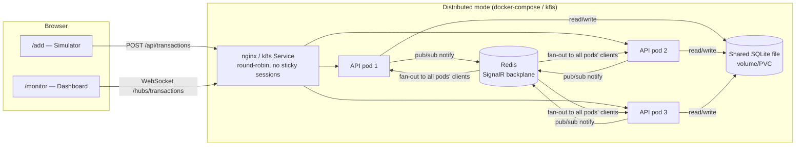

# Real-Time Financial Monitor

MVP for a real-time financial transaction monitor: a .NET backend ingests transactions over
HTTP and broadcasts them over SignalR to a React dashboard used by support agents.

## 1. Scenario recap

Transactions arrive via an ingestion API, get validated and stored, and must appear on a live
dashboard instantly. The dashboard must stay responsive even if 100 transactions arrive in a
burst, and must keep working correctly if the backend is scaled out to multiple pod replicas.

## 2. Architecture



- **Ingestion**: `POST /api/transactions` validates and stores the transaction, then broadcasts
  it over SignalR.
- **Real-time layer**: SignalR hub (`/hubs/transactions`), push-only.
- **Storage**: two modes behind the same `ITransactionRepository` interface -
  - *Single instance / local dev*: `InMemoryTransactionRepository` (`ConcurrentDictionary`).
  - *Distributed (compose/k8s)*: `SqliteTransactionRepository` pointed at one shared file on a
    mounted volume/PVC, so `GET /api/transactions` is consistent no matter which pod answers it.
- **Cross-pod real-time sync**: SignalR's Redis backplane (`AddStackExchangeRedis`) so a
  broadcast from any pod reaches every connected client, regardless of which pod it's attached
  to. See the [ADR](#9-adr-distributed-real-time-synchronization-across-pod-replicas) below.

## 3. Tech stack

| Layer | Choice |
|---|---|
| Backend | .NET 8, minimal APIs, SignalR |
| Domain/tests | xUnit, FluentAssertions, Moq |
| Storage | `ConcurrentDictionary` (single instance) / SQLite (distributed) |
| Real-time backplane | Redis (`Microsoft.AspNetCore.SignalR.StackExchangeRedis`) |
| Frontend | React 19, TypeScript, Vite, React Router, `@microsoft/signalr`, framer-motion |
| Containers | Docker (multi-stage, alpine), docker-compose, nginx |
| Orchestration | Kubernetes manifests (Deployment/Service for API, Redis, frontend) + HorizontalPodAutoscaler |

## 4. Project structure

```
mid-fullstack-assessment/
├── backend/
│   ├── src/FinMonitor.Domain/   # model, validation, repositories, service - no ASP.NET/SignalR refs
│   └── src/FinMonitor.Api/      # Program.cs, endpoints, hub, Dockerfile
│   └── tests/FinMonitor.Tests/  # xUnit
├── frontend/                    # Vite + React + TypeScript
├── docker-compose.yml           # redis + 3 API replicas + nginx LB (distributed proof)
├── docker/nginx-lb.conf         # WS-aware load balancer config, round-robin
├── k8s/                         # Deployment/Service manifests for api, redis, frontend + hpa.yaml
└── scripts/hammer.ps1           # 100-rapid-POST load test (standalone, without the UI button)
```

## 5. Run locally (single instance)

No Redis, no Docker needed - in-memory storage, one backend process.

```bash
cd backend/src/FinMonitor.Api
dotnet run --urls http://localhost:5080
```

```bash
cd frontend
npm install
npm run dev
```

Open `http://localhost:5173/add` to send transactions and `http://localhost:5173/monitor` in
another tab to watch them arrive live. Vite's dev server proxies `/api` and `/hubs` to
`localhost:5080` (see `frontend/vite.config.ts`) so no CORS setup is needed in dev.

## 6. Run the distributed proof (docker-compose)

> **Note on this build's verification:** the compose stack below was written and reviewed but
> could not be run live in the environment this was built in - Docker Desktop's WSL2 backend had
> no Linux distribution installed (`wsl -l -v` reported none) and couldn't be brought up. The
> distributed-storage mechanism it depends on *is* verified independently:
> `SqliteTransactionRepositoryTests.TryAdd_With200ConcurrentUniqueTransactionsAcrossMultipleInstances_AllStoredWithNoLostUpdates`
> runs 200 concurrent writes from many separate `SqliteTransactionRepository` instances against
> one shared file and confirms no lost or duplicate writes - the exact cross-process behavior the
> distributed mode relies on, exercised without needing containers. Run `docker compose up --build`
> yourself to see the full multi-pod proof end-to-end.

```bash
docker compose up --build
```

This starts Redis, three API replicas (`api1`/`api2`/`api3`, each with `Redis:Enabled=true` and
pointed at a shared SQLite file on a named volume), and one nginx container that serves the
built frontend and round-robins `/api` and `/hubs` across the three replicas.

Open `http://localhost:8080/monitor`, then from a shell:

```bash
for i in $(seq 1 10); do
  curl -s -i -X POST http://localhost:8080/api/transactions \
    -H "Content-Type: application/json" \
    -d "{\"amount\": $i, \"currency\": \"USD\", \"status\": \"Completed\"}" \
    | grep -i x-served-by
done
```

You'll see `X-Served-By` vary across `api1`/`api2`/`api3` (proving round-robin, no sticky
sessions), while the dashboard still shows all 10 transactions regardless of which pod served
each POST - proving the Redis backplane fan-out works.

**Before/after, to see the bug the backplane fixes:** set `Redis__Enabled: "false"` for the
`api1`/`api2`/`api3` services in `docker-compose.yml`, `docker compose up --build` again, and
repeat the curl loop - the dashboard will now visibly miss transactions served by any pod other
than the one its WebSocket happens to be connected to. Re-enable it afterwards (it's `"true"` in
the committed file).

## 7. Run tests

```bash
cd backend
dotnet test tests/FinMonitor.Tests/FinMonitor.Tests.csproj
```

31 tests covering validation, repository concurrency (both in-memory and SQLite-across-instances),
the service layer, and the HTTP endpoints end-to-end via `WebApplicationFactory`.

**On the TDD process**: tests were written before their corresponding implementation, one
component at a time (Validator → Repository/concurrency → Service → Endpoints), confirmed to
fail to compile ("red") before writing the minimal code to pass ("green"). Model/DTO shapes were
fixed first as a design step, not implementation. This is stated plainly here rather than
claimed after the fact - the honest description of a single-session build.

The assignment's unit-test requirement (§3) is scoped to backend processing/concurrency/storage;
there's no frontend unit-test suite. The frontend is verified by `npm run build` (type-checked)
and by manually driving both routes in a browser - see the [load-test verification](#8-load-test-verification)
section below for what that looked like in practice, including two real bugs it caught.

## 8. Load-test verification

The Simulator page (`/add`) has a **"Fire 100"** button that fires 100 concurrent POSTs from the
browser and reports how many succeeded and how long it took - a live, demo-able proof of the "UI
stays responsive with 100 rapid transactions" requirement. `scripts/hammer.ps1` does the same
thing from PowerShell, independent of the UI, for a from-outside check.

This was run for real during development, against the actual backend and dashboard (not just
assumed to work), which surfaced two real bugs before they shipped:

1. **Dropped transactions under load** (`useTransactionStream.ts`): the dedup `Set` was being
   mutated *inside* the `setTransactions` updater function. React (in StrictMode) double-invokes
   functional updaters to catch impure ones; the second invocation saw the ids as already "seen"
   and returned the previous state unchanged, silently reverting real updates. Fix: compute the
   deduped batch *before* calling `setTransactions`, so the updater itself is a pure function of
   `prev`.
2. **Filter stopped working at ~100 rows** (`TransactionGrid.tsx`): `framer-motion`'s
   `AnimatePresence` failed to remove exited rows from the DOM at this list size when animating
   `<tr>` elements, so filtering appeared to update the count but not the rendered rows. Fix:
   drop `AnimatePresence`'s exit-tracking (a bonus nicety) rather than risk it undermining a core
   requirement; rows still get an entrance fade/slide, which doesn't need exit-tracking.

Both were caught by actually running the "Fire 100" flow in a browser and checking the resulting
DOM/state, not by inspection - which is the whole point of that button.

## 9. ADR: Distributed Real-Time Synchronization Across Pod Replicas

**Context.** If this backend is deployed as N pod replicas behind a load balancer, a client's
WebSocket connects to exactly one pod. By default, SignalR keeps its connected-client list in
that pod's memory only, so `Clients.All.SendAsync(...)` on Pod A never reaches a client connected
to Pod B. Similarly, if storage were per-pod in-memory, `GET /api/transactions` would only ever
reflect whatever that one pod happened to receive.

**Decision.** Two changes, addressing the two halves of the problem:
- **Real-time fan-out**: SignalR's official Redis backplane
  (`AddSignalR().AddStackExchangeRedis(...)`). Every pod publishes broadcasts to a shared Redis
  pub/sub channel; every pod's SignalR runtime subscribes and re-broadcasts to its own locally
  connected clients. Feature-flagged via `Redis:Enabled` (default `false`) so local single-instance
  dev needs no Redis at all. The connection string uses `abortConnect=false` so a Redis outage
  degrades to pod-local broadcast instead of crashing the app.
- **Consistent storage**: in distributed mode, `Storage:Provider=Sqlite` switches the repository
  to a single SQLite file on a volume/PVC shared by every replica, so `GET /api/transactions`
  returns the same answer regardless of which pod serves the request. Single-instance/local dev
  keeps the simpler in-memory `ConcurrentDictionary` (no shared-storage problem exists with one
  process).

**Consequences.**
- (+) Near-real-time cross-pod fan-out using an officially supported SignalR extension; minimal
  code change (one conditional `AddStackExchangeRedis` call).
- (+) Consistent read-your-writes across pods for the GET snapshot, closing the gap a purely
  in-memory distributed store would leave.
- (−) Redis becomes an infra dependency and adds a latency hop; it's a SPOF for cross-pod
  real-time sync unless run HA (not done here - documented, not implemented).
- (−) The shared SQLite file requires ReadWriteMany storage in Kubernetes (NFS/EFS/Azure Files);
  most default cloud block-storage classes are ReadWriteOnly and won't satisfy this. Documented
  in `k8s/sqlite-pvc.yaml`; not provisioned as part of this assessment.
- (−) SQLite serializes writers at the file level; fine at this MVP's throughput, would not scale
  to a high-write-volume production workload - a managed relational/NoSQL store would replace it
  at that point without changing `ITransactionRepository`'s shape.

**Alternatives considered.**
- *Sticky sessions* (route a client to the same pod every time): rejected - it hides the bug
  rather than fixing it, and defeats the point of load balancing.
- *Client-side polling instead of push*: rejected - contradicts the "instant" real-time
  requirement outright.
- *Shared external store from the start* (skip in-memory entirely): rejected for local dev - it
  would mean every developer needs SQLite/Docker running just to run the app once, for no benefit
  in the single-instance case where the distributed-storage problem doesn't exist yet.

## 10. Bonus checklist

| Item | Status |
|---|---|
| Distributed architecture - described | ✅ (ADR above) |
| Distributed architecture - implemented | ✅ Redis backplane + shared SQLite; cross-process storage proven by `SqliteTransactionRepositoryTests`, full compose stack written but **not run live** (no working Docker engine in the build environment - see §6) |
| Dockerfile, production-optimized | ✅ multi-stage, alpine, non-root, `DOTNET_SYSTEM_GLOBALIZATION_INVARIANT=true` - written and reviewed, **not** built in this environment (same Docker-engine limitation) |
| Kubernetes manifests | ✅ `k8s/deployment.yaml` + `service.yaml` (+ redis, frontend, PVC) - validated as YAML, **not** applied to a live cluster (none provisioned for this assessment) |
| Horizontal autoscaling | ✅ `k8s/hpa.yaml` - 3-10 replicas, scales on 70% memory utilization. A separate concern from the sync fix: correctness across pods (Redis/SQLite) has to hold first, or autoscaling would just add more out-of-sync pods. Requires a metrics-server in the cluster; not verified live (same limitation as the rest of `k8s/`) |
| UI animation on new transactions | ✅ row entrance fade/slide (framer-motion) |
| UI animation on status change | ✅ CSS transition on the status badge |
| List virtualization | ❌ deliberately skipped - batching + memoization is sufficient at this scale (see §11), and it fights row-level exit animations |
| Redis/PVC high availability | ❌ future work, documented in the ADR |

## 11. Known limitations / future work

- No retention cap on the in-memory store (single-instance mode) - fine for an MVP demo session,
  would need eviction/paging for long-running use.
- The frontend caps its rendered window at the 500 most recent transactions
  (`MAX_TRANSACTIONS` in `useTransactionStream.ts`) to bound DOM size under sustained load.
- No authentication/authorization on the ingestion API - out of scope for this assessment but
  would be required before any real deployment.
- Redis and the SQLite PVC are both single points of failure in the k8s manifests as written;
  production would need Redis Sentinel/Cluster and a properly provisioned RWX storage backend.
